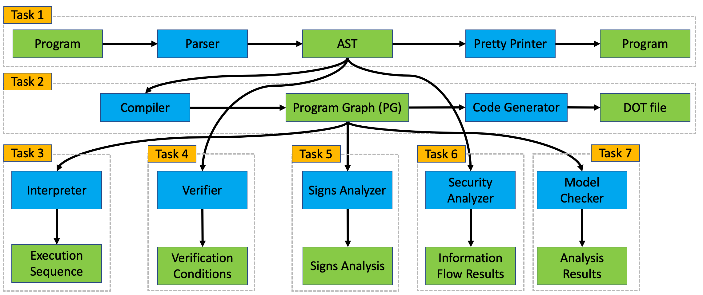

# Mandatory Assignment

All material you need to work on the mandatory assignment is found in this git repository.

**Please read this document carefully as it explains the tasks and rules of the mandatory assignment.**

This document is structured as follows:

1. [Goals of the mandatory assignment](#goals-of-the-mandatory-assignment)
3. [Guidelines and Deadlines](#guidelines-and-deadlines)
4. [Getting started with the code framework](#getting-started-with-the-code-framework)
5. [Definition of Yet Another GCL Language](#yet-another-gcl-variant)
6. [Task descriptions](#tasks)


## Goals of the mandatory assignment

The overall goal of the mandatory assignment is to build a tool for running and analysing programs written in a variant of the Guarded Command Language (GCL).
That is, you will learn about the most common steps one encounters when developing a new programming language.
You will also implement various tools that help programmers to write correct programs in that language.
Most components of the mandatory assignment can be seen as a basic version of [http://www.formalmethods.dk/fm4fun](http://www.formalmethods.dk/fm4fun).

The assignment is divided into seven tasks, where each tasks corresponds to a module of your tool.
The overall structure of the assignment is illustrated below, where green boxes are inputs and outputs of your tool; blue boxes represent components that you have to implement.



We briefly describe the aims of each task:

1. In task 1, you will implement a *parser* that takes a program in our new programming language and turns it into an abstract syntax tree (AST) - one of the main data structures used by the other components. To test your implementation, you will also implement a *pretty printer* that traverses the AST and outputs the original program in a nice format.
2. In task 2, you will implement a *compiler* that takes the AST of a program and constructs its program graph (PG) - another data structure used for running and analyzing programs. To simplify debugging, you will also implement a *printer* that outputs a graphical representation of program graphs.
3. In task 3, you will implement an *interpreter* that takes a program graph and an initial memory and computes the program's (complete) execution sequences when started on that memory.
4. In tasks 4 - 7, you will implement tools that help programmers with writing correct programs:
    - In task 4, you will implement a *verifier* that checks whether a program does what it has been specified to do.
    - In task 5, you will implement a *signs analysis* that determines the signs of variables at every point of a program's execution; such information can be used to detect bugs, such as a division by zero, before actually running the program.
    - In task 6, you will implement another program analysis that checks whether your program leaks confidential information.
    - In task 7, you will implement a small model checker to analyse more advanced properties.

## Guidelines and Deadlines

### Rules

- You should work on the project in groups of size 2 - 3. 
- You have to use your group's git repository (which also contains this document) to work on the mandatory assignments. All solutions must be handed in by comitting *and pushing* them to your group's git repository.
    * If you have not used git before, you can find [tutorials online](https://git-scm.com/docs/gittutorial).
- You can push to your group's repository as often as you want. We will consider the last push before each task's [deadline]() as your submission.
- You can continue working on the module of a task after the deadline. However, such updates will not be evaluated.
- You have to implement your solutions within the code framework provided in this repository. 
- Your solution must be implemented in F#.
- You have to implement the techniques presented in the teaching material.
- You are allowed to add more files but do not forget to add them to your git repository.
- ***Do not modify or add any code in the existing files unless it is explicitly allowed by a comment of the form***
```
// TODO: start here
```


### Deadlines

**For each task, you have to hand in your solution by comitting and *pushing* them into your group's repository before the task's deadline listed below.**
 
- Task 1: March 9, 23:59
- Task 2: March 16, 23:59
- Task 3: March 27, 23:59
- Task 4: April 13, 23:59
- Task 5: April 24, 23:59
- Task 6: May 8, 23:59
- Task 7: ???

### Feedback

We will *not* publish solutions of any mandatory assignment tasks.
Instead, the code framework comes with an evaluation tool that automatically gives you feedback on your solutions for tasks 2 - 6, whenever you push your solutions to this repository. 

Furthermore, we encourage you to practively seek feedback from the TAs and the teacher in class during lab days.

### Evaluation

We want to encourage you to design, implement, test, and analyze your code carefully. 
Hence, your final submissions will be checked by a more powerful version of the evaluation tool.
In other words: even if the evaluation tool does not detect any errors after pushing your solutions, the final evaluation might still be able to spot some errors.

The assignment is *mandatory*: you need to hand-in a *reasonable* solution for each task in order to be admitted to the final exam.

By *reasonable*, we mean that your solution does not always have to work perfectly, but your solution should demonstrate that you can faithfully implement the techniques covered in class.
As a general guideline, if you push your solution and the evaluation tool does not report any errors and there is no obvious cheating (e.g. hard-coding certain examples), you can safely assume that your solution is reasonable.

### Student competition

After every deadline, we will publish a overview of the solutions of all groups such that you can compare the quality of your solution against those of your classmates. The solutions will be ranked according to the number of detected errors and their efficiency.

The group names will be anonymised, i.e. you will only be able to identify the position of your own group in the ranking.
The code to identify your own group is found in this repository [TODO: link to your code]().

Your placement in the ranking does *not* affect your final grade. You should rather see it as a motivation to produce high-quality code.

## Getting started with the code framework

This repository contains the skeleton of a parser along with the input and output types for each task in the assignment. It also contains an example of a "calculator" program in F# that reads an arithmetic expression from the command line and print the result of evaluating such expression for initial testing.

### Files

The existing code framework contains an example project that implements a parser for arithmetic expressions together with a small calculator.
You can have a look at the calculator's implementation in the following files:

* [Lexer.fsl](Lexer.fsl): The lexer for arithmetic expressions
* [Parser.fsp](Parser.fsp): The parser for arithmetic expressions
* [AST.fs](AST.fs): Types for the AST of arithmetic expressions

The entrypoint for your tool as a whole is [Program.fs](Program.fs). It contains the main function that invokes the calculator as well as your solutions to future tasks. **Your are not allowed to change the main function**.
Moreover, the file [Types.fs](Types.fs) contains global types that are used in many analysis tasks.

For tasks 1 - 6, the framework contains dedicated files and functions that you should implement:
* [Graph.fs](Graph.fs): File for tasks 1 and 2: parse and compile GCL programs to program graphs
* [Interpreter.fs](Interpreter.fs): File for task 3: interpreter
* [ProgramVerification.fs](ProgramVerification.fs): File for task 4: program verification
* [SignAnalysis.fs](SignAnalysis.fs): File for task 5: sign analysis
* [Security.fs](Security.fs): File for task 6: security analysis

The above files typically contain a few definitions that you are **not** allowed to change. You should only add or modify code in or after lines marked with `// TODO: start here`. For example, in the snippet of `Graph.fs` below, you should replace `failwith "Graph analysis not yet implemented` with your solution.
Feel free to add additional functions, files, etc.

```
// ...

let analysis (src: string) (input: Input) : Output =
    failwith "Graph analysis not yet implemented" // TODO: start here
```


### Installation

Building this project requires .NET 7.0.

- **Windows:** Installation instructions for this, can be found [here](https://dotnet.microsoft.com/en-us/download).
- **macOS:** Building on macOS requires the `dotnet-sdk` package. This can be installed using [Homebrew](https://brew.sh) and running `brew install dotnet-sdk`
- **Linux:** There are many ways to install on Linux, but a good starting point might be [this](https://fsharp.org/use/linux/).


### Running the code

To run the program execute the following in the root directory of this repository:

```bash
dotnet run
```

This should display a list of the available commands that you can run. Among these are the calculator, which is a good starting point.

For example, you can run the calculator as follows:

```bash
dotnet run calc "1 + 52 * 23"
```

### Interactive user interface

When you get further, you can use your tool in a graphical user interface. 
To this end, run the following from the root folder of this repository depending on your operating system:

```bash
# Windows
./dev/win.exe --open

# macOS
./dev/macos --open

# linux
./dev/linux --open
```

This should open the user interface in your browser (at `http://localhost:3000/`).

The tool knows how to compile your program by the instructions in `run.toml`. 
Typically, there should be no need to modify this file.

#### Downloading updates

It is recommended to update the binaries in `dev/` regularly. You can do this by running the command below matching your platform, and following the instructions when prompted:

```bash
# Windows
./dev/win.exe --self-update

# macOS
./dev/macos --self-update

# linux
./dev/linux --self-update
```

### Evaluation

We recommend reguarly pushing your work to this repository; your last push before the deadline will count as your submission.

Every time you push your solutions to this repository, the evaluation tool will analyze it and produce feedback for you.
You can inspect the generated feedback on the GitLab page of your reposiroty in the `result` branch.


## Yet Another GCL Variant

The variant of the Guarded Command Language (GCL) that you have to consider throughout the mandatory assignment is a subset of the language used by [http://www.formalmethods.dk/fm4fun](http://www.formalmethods.dk/fm4fun).
More precisely, the language is given by the following BNF grammar:

```
C  ::=  x := a  |  A[a] := a  |  skip  |  C ; C  |  if GC fi  |  do GC od
GC ::=  b -> C  |  GC [] GC
a  ::=  n  |  x  |  A[a]  |  a + a  |  a - a  |  a * a  |  a / a  |  - a  |  a ^ a  |  (a)
b  ::=  true  |  false  |  b & b  |  b | b  |  b && b  |  b || b  |  ! b
     |  a = a  |  a != a  |  a > a  |  a >= a  |  a < a  |  a <= a  |  (b)
```
where `n` is an integer number, `x` is a program variable, and `A` is an array.

The syntax of variables and numbers, and the associativity and precedence of operators must be the same as in [http://www.formalmethods.dk/fm4fun](http://www.formalmethods.dk/fm4fun); you can find more details on FM4FUN by clicking on the question mark of besides "Examples".
We reproduce parts of the rules here for your convenience:

- Variables `x` and arrays `A` are strings matching the regular expression `[a-zA-Z][a-zA-Z\d ]*` and cannot be any of the language's keywords (e.g. no variable may be named `if` or `od`).
- Numbers `n` match the regular expression `\d+`. 
- We consider numbers as mathematical, i.e. unbounded, integers. In F#, this means that numbers should have the type `bigint` -  an abbreviation for [BigInteger in C#](https://learn.microsoft.com/en-us/dotnet/api/system.numerics.biginteger?view=net-7.0). 
- A whitespace matches the regular expression `[\u00A0 \n \r \t]`, with a mandatory whitespace after if, do, and before fi, od. Whitespaces are ignored anywhere else.
- Precedence and associativity rules:
    * In arithmetic expressions, precedence is highest for `-` (unary minus), then `^`, then `*` and `/`, and lowest for `+` and `-` (binary minus).
    * In boolean expressions, precedence is highest for `!`, then `&` and `&&`, and lowest for `|` and `||`.
    * Operators `*`, `/`, `+`, `-`, `&`, `|`, `&&`, and `||` are left-associative.
    * Operators `^`, `[]`, and `;` are right associative.

**In the rest of the document GCL refers to the above language.**

## Tasks

### Task 1: A parser for GCL

> **Relevant files:** [Graph.fs](Graph.fs); you may also want to add files for creating a lexer and parser with FsLexYacc.

The goal of this task is to implement a parser for GCL that accepts or rejects programs and builds ASTs for them, thus working like the syntax checker of [formalmethods.dk/fm4fun](http://www.formalmethods.dk/fm4fun/). The parser must take as input a string intended to describe a GCL program and must build an AST for it. In addition, the program must produce compilation results: it should return whether the input is a program accepted by the GCL grammar specified above. You should also implement a ”Pretty Printer” module that prints the AST so you can easily check your solution.
Hints: Use a parser generator as seen in class. Start with the grammar as given above and adapt it to your parser generator. You may need to specify precedence/associativity of some operators in the parser generator language, or by applying some of the grammar transformations seen in class. Your parser needs to generate abstract syntax, which you will need in task 2.

### Task 2: A Compiler for GCL

> **Relevant files:** [Graph.fs](Graph.fs)

The goal of this task is to implement a compiler that turns GCL programs into Program Graphs (PGs) similar to the results you obtain under “Program Graph” in [formalmethods.dk/fm4fun](http://www.formalmethods.dk/fm4fun/). 

To this end, implement the function
```
let analysis (src: string) (input: Input) : Output = 
```
which takes a string representation of a GCL program and produces a string representation of a program graph in the [DOT language](https://graphviz.org/doc/info/lang.html) - a language for visualizing graphs.
That is, the compiler must produce a program graph in the textual graphviz format used by the export feature on [formalmethods.dk/fm4fun](http://www.formalmethods.dk/fm4fun/). 

The additional argument `input` determines whether you have to produce a deterministic or a non-deterministic program graph.

*Hints:* Enrich the parser developed in Task 1 so that it exploits the abstract syntax for GCL programs. Follow [Formal Methods, Chapter 2.2] to construct a program graph for a GCL program. 


### Task 3: An Interpreter for GCL

> **Relevant files:** [Interpreter.fs](Interpreter.fs)

The goal of this task is to implement an interpreter for GCL programs that works similarly to the environment “Step-wise Execution” on [formalmethods.dk/fm4fun](http://www.formalmethods.dk/fm4fun/). 

To this end, implement the function
```
let analysis (src: string) (input: Input) : Output =
```
The above functon takes a string representation of a GCL program and a structure input that determines 
- whether we consider a deterministic program graph or not,
- the initial memory, and
- a `trace_size`.
As an output, the function should produce an execution sequence of length `trace_size` starting in an initial configuration with the provided initial memory. If no execution sequence of that length exists, it should produce an execution sequence that is complete or gets stuck.
Moreover, the output should indicate whether the execution sequence is complete, stuck or still running, i.e. it can still be extended.
The types for producing such an output are provided in [Interpreter.fs](Interpreter.fs).

*Hints:* Follow [Formal Methods, Chapter 1.2] and [Formal Methods, Chapter 2.3] to build an interpreter based on the semantics of GCL programs and their program graphs.


### Task 4: Program Verification

> **Relevant files:** [ProgramVerification.fs](ProgramVerification.fs)

Implement a tool that computes the weakest precondition of a given GCL program and a postcondition.
To this end, implement the function
```
let analysis (src: string) (input: Input) : Output =
```
which takes two strings - a GCL program and a postcondition `F` - as an input and produces the weakest precondition of that program and that postcondition as an output.

For this task, it is fine to consider a reduced fragment of our langauge that is given by the following grammar:
```
C  ::=  x := a  |  skip  |  C ; C  |  if GC fi
GC ::=  b -> C  |  GC [] GC
a  ::=  n  |  x  |  a + a  |  a - a  |  a * a  |  - a  |  (a)
b  ::=  true  |  false  |  b & b  |  b | b  |  b && b  |  b || b  |  ! b
     |  a = a  |  a != a  |  a > a  |  a >= a  |  a < a  |  a <= a  |  (b)
F  ::=  b 
```
That is, you do not have to consider loops and expressions that can crash. 
Moreover, formulas `F` are identical to Boolean expressions `b`.

If you have some time left, you can work on the following extensions:

- Extend your verifier such that it supports the command `do [inv F] GC od`, that is, enable verification of loops with user-supplied invariant formulas `F`.
- Extend your verifier such that it supports the division operation `a / a` in arithmetic expressions.

*Hints:* Follow the approach in the supplementary material on program verification.

### Task 5: A Sign Analyser for GCL

> **Relevant files:** [SignAnalysis.fs](SignAnalysis.fs)

The goal of this task is to implement a tool for sign analysis of GCL programs that works like the one available under environment “Detection of Signs Analysis” on [formalmethods.dk/fm4fun](http://www.formalmethods.dk/fm4fun/). The sign analysis must follow the approach in [Formal Methods, Chapter 4].

To this end, implement the function
```
let analysis (src: string) (input: Input) : Output =
```
The above functon takes a string representation of a GCL program and a structure `input` that determines 
- whether we consider a deterministic program graph or not and
- the initial sign assignment.
It should return the initial node, the final node, and the reszkt of a sign analysis for the variables.

*Hints:* Enrich the parser as you did in Task 3 and follow [Formal Methods, Chapter 4] for implementing the sign analysis.

### Task 6: A Security Analyser for GCL

> **Relevant files:** [Security.fs](Security.fs)

The goal of this task is to implement a tool for security analysis of GCL programs, that works as a simplified version of the environment “Security Analysis” on [formalmethods.dk/fm4fun](http://www.formalmethods.dk/fm4fun/). The security analysis must follow the approach in [Formal methods, Chapter 5.3-5.4]. 

To this end, implement the function
```
let analysis (src: string) (input: Input) : Output =
```
which takes a GCL program as well as a security lattice and a security classification for variables.
It should produce the actual and allowed information flows as well as all violations.

*Hints:* Enrich the parser as you did in Task 3 and follow [Formal Methods, Chapter 5.4] for implementing security analysis. Base your analysis on deterministic program graphs.


### Task 7: A Model Checker for GCL

TODO: it seems difficult to make this mandatory. Perhaps change the task such that it can be completed in class?

